<div align="center">

# 一亩三分地本地工具

**本机自动签到、答题，并核对大米到账。**

在你自己的电脑上、用你自己的账号完成，不经过任何第三方。

[](https://pypi.org/project/1point3acres-toolkit/)
[](https://github.com/vivian-labs/1point3acres-toolkit/actions/workflows/consistency.yml)


[](LICENSE)

[它每天做什么](#效果) · [怎么工作](#总览) · [安全与隐私](#安全) · [快速开始](#快速开始) · [常见问题](#常见问题) · [给开发者](#开发者)

</div>

每天自动帮你完成一亩三分地（1point3acres）的 **签到** 和 **每日答题**，成功以当天两项奖励记录为准。电脑可用、登录和网站验证正常、答案能够确定时可自动完成；异常会保留真实状态。它不是把账号交给某个服务器代跑，而是在你电脑上开一个专用的 Chrome，用你自己的登录，按网站流程点按钮，点完还会去积分页确认大米真的到账。

支持 macOS 和 Windows，只需要装好 Chrome 和 Python 3.12。签到答题之外，它还能采集面经、离线搜索、发帖回复，并能接给 Claude Code、Codex 这类 AI 助手用。这些是附加功能，不装不影响签到答题。

> [!NOTE]
> 本文讲「它是怎么做的」；具体命令、参数和排错步骤都在 [使用说明](outputs/一亩三分地本地工具/README.md)。

## 最近更新

- **PyPI 1.1.0 已发布。** [软件包](https://pypi.org/project/1point3acres-toolkit/1.1.0/)和 [GitHub Release](https://github.com/vivian-labs/1point3acres-toolkit/releases/tag/v1.1.0) 均已上线；`uvx …@latest` 的下载安装、MCP 连接和工具调用已验证。普通用户无需克隆仓库，新版本发布后重启 MCP 即可检查更新。见 [快速开始](#快速开始)。
- **离线版本诊断。** 命令行 `info` 和 MCP 工具 `runtime_info` 可以核对磁盘源码、当前进程加载的版本与调度配置，发现更新后仍在运行的旧进程。见 [更新与维护](#维护)。
- **Windows 定时任务。** 仓库版提供 `计划.ps1`，支持预览、安装、查看状态和移除，每分钟通过 `pythonw.exe` 检查一次，不弹控制台窗口。见 [每日自动运行](outputs/一亩三分地本地工具/README.md#automation)。
- **重启后接着跑。** 每日随机时间、心情短句、签到后的答题等待截止时间和提交意图都先保存在本机；恢复时复用记录，失败后按 5、10、20、40、60 分钟逐步等待，避免反复访问网站。

## 目录

| 你想 | 看这里 |
|:--|:--|
| **先看效果** | [它每天替你做什么](#效果) |
| **看懂原理** | [三分钟总览](#总览) · [自动签到](#签到) · [自动答题](#答题) · [怎么算真的成功](#核对) · [出错了怎么自救](#重试) · [每天什么时候跑](#调度) |
| **放心用** | [安全与隐私：你的数据在哪](#安全) |
| **动手** | [快速开始](#快速开始) · [其他功能](#其他功能) · [常见问题](#常见问题) · [更新](#维护) |
| **改代码** | [技术栈](#技术栈) · [代码结构](#代码结构) · [测试与 CI](#测试) |

<a id="效果"></a>

## 它每天替你做什么

打开一亩三分地右上角的「今日任务」，两项都是「已完成」：


打开「我的积分」，每天都有两条 +1 大米的记录：一条「签到奖励」，一条「每日答题」。


以上是每日任务的目标示意，不是本次实测截图。每日计划只负责签到答题；其他互动通过独立命令调用。签到时会随机选一个心情、配一句语料摘句或模板短句；不想要可以关掉，见 [自动签到](#签到)。

<a id="总览"></a>

## 三分钟看懂它怎么工作

一句话：**你的电脑每分钟醒来问一次「今天签了吗」，没签就开一个专用的 Chrome，用你自己的登录，按网站流程点按钮，点完再去积分页确认大米真的到账。**

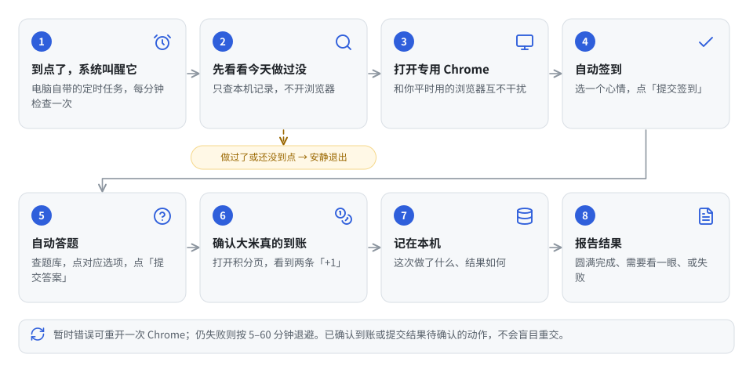

1. **到点了，系统叫醒它。** 用的是电脑自带的定时任务功能，每分钟叫醒一次。
2. **先看看今天做过没。** 只翻本机的记录，不开浏览器：还没到你设定的时间？今天两项都已经到账了？是的话直接退出。绝大多数时候都停在这一步，所以每分钟跑一次也不费资源。
3. **打开专用 Chrome。** 和你平时用的浏览器互不干扰，见下一小节。
4. **自动签到。** 打开签到页，选一个心情，点「提交签到」。细节见 [自动签到](#签到)。
5. **自动答题。** 读出今天的题目和选项，和题库比对，命中就点对应选项、点「提交答案」。细节见 [自动答题](#答题)。
6. **确认大米真的到账。** 打开积分页，看到当天的「签到奖励 +1」和「每日答题 +1」，而且是你账号名下的。细节见 [怎么算真的成功](#核对)。
7. **记在本机。** 这次做了什么、结果如何，写进你电脑上的记录，以后可以离线查。
8. **报告结果。** 结论只有三种：圆满完成、需要看一眼、失败。

### 专用 Chrome 是什么

工具不会动你平时用的浏览器。它用电脑上已经装好的 Chrome 程序，但给它一套独立的设置和登录状态，里面只有这个论坛的登录。跑完就关，不常驻后台。


三个配套的保险：同一时刻只有一个任务能用它；一次运行最多 15 分钟，超时就强制关掉；它只允许打开论坛自己的网址，别的地址在代码里直接拒绝。

<a id="签到"></a>

## 自动签到是怎么做的

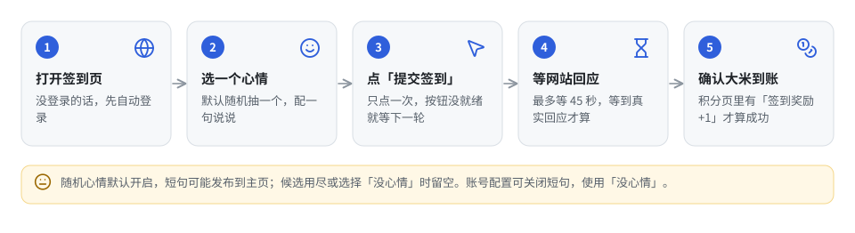

1. **打开签到页。** 打开前先确认登录还在不在，不在就自动恢复（见下面「登录是怎么自动恢复的」）。
2. **选心情。** 签到页要求选一个心情。默认随机抽一个，并配一句「说说」，选择会按天保存；不想要可以关掉，关掉后每天固定选「没心情」、什么都不写（见下面「关于今日心情 / 说说」）。
3. **点「提交签到」。** 只点一次。按钮还没就绪（页面没加载完）就先退出，留给下一轮再来，不会硬点。
4. **等网站回应。** 点完按钮不算数。工具会盯着网络请求，等到网站真的回应了才往下走，最多等 45 秒。快超时时会自动再试一次人机验证。
5. **确认大米到账。** 打开积分页，看当天有没有一条「签到奖励」、大米 +1、属于你账号的记录。有，这一项才算成功。

### 登录是怎么自动恢复的

每次运行开头都先问网站一句「还登录着吗」。过期了，就打开网站自己的登录页，把系统保管的用户名密码填进去，等网站的人机验证通过，点登录。登录成功后再核对一次：网站返回的账号必须和你配置里写的一致，不一致就立刻停下，绝不用别人的账号操作。


### 关于「今日心情 / 说说」

签到页的「说说」会成为主页上的公开记录。默认随机选择心情和短句；这些是语料摘句或模板表达，不是根据个人生活生成的日记。

- 心情使用统一配置的偏好权重，不代表实测的人类行为，也不保证避免自动化识别。
- 只有昨天有记录才使用心情延续规则：25% 直接延续，其余按权重抽取（仍可能抽到相同心情）。缺席多天不会把上次误当作昨天。
- 同一账号、同一站点日的选择先写入 SQLite，页面准备失败或重启后保持不变。
- 离线语料库从固定版本的 136,320 个原始文本片段筛出 **35,469 条摘句：35,432 条唐诗摘句、37 条现代短句**。诗句带原作者；现代来源的合格短句很少，不把诗句数冒充口语数。原模板库的 109 条记录继续作为后备，其中「没心情」不发表文案。
- `account.json` 可设置 `"journal_style": "mixed"`（默认）、`"modern"` 或 `"poetry"`。混合模式优先抽口语的概率为 80%、诗句为 20%；某类用尽会尝试另一类，因此长期运行后诗句占比可能很高。只想要口语请用 `modern`，其可用池会小得多。诗词模式优先诗词；指定风格用尽时尝试原心情模板。
- 系统随机源选择候选，排除之前 **365 个日历日**已用的文字；忽略标点、空格、诗句署名，按字符三元组 Dice 相似度 ≥80% 排除近似句。候选全部用尽或抽到「没心情」时留空签到。繁简转换和语义改写仍可能产生相似句，不保证不同账号或不同机器绝不碰撞。
- 在 `account.json` 设置 `"checkin_mood_random": false` 会立即停止发布短句，即使当天已有随机计划。奖励核验规则不变。

来源、授权、如何重建词库见[本地工具的语料说明](outputs/一亩三分地本地工具/README.md#journal-corpus)。不在每天运行时下载文本库，也不调用模型生成文案。

<a id="答题"></a>

## 自动答题是怎么做的


1. **读题。** 工具不去截图识别，而是直接从网站拿到今天的题目原文和全部选项。都是文字，没有歧义。
2. **查题库。** 题库有两份，合并使用。一份是随仓库分发的题库，194 道题，就是「题目 → 正确选项文字」的对照表，你可以直接打开看。另一份只存在你电脑上，记的是这个账号 **实际答对并到账过** 的题。你电脑上这份优先，因为「在你账号上验证过」比「别人整理的」更可信。
3. **点选项。** 只点文字和答案完全一样的那个按钮。
4. **点「提交答案」。** 只点一次。
5. **等网站回应。** 最多 45 秒。
6. **确认大米到账。** 积分页里当天有「每日答题 +1」，这一项才算成功。

匹配的原理见下图：先把题目和选项的格式统一（全角半角、多余空格），再按 **选项文字** 精确比对。不按 A/B/C/D 的位置，因为网站每天可能打乱选项顺序。必须 **恰好命中一个** 选项才算匹配。


**题库没有怎么办？它不会瞎猜。** 直接停下，把题目原文和全部选项写进结果里。你查一次正确答案，用每日命令带上原题和正确选项的完整文字补答一次（写法见使用说明），也可以让 AI 助手查一次再填。工具会先确认网站今天的题还是这道，再作答。

> [!TIP]
> 仓库题库里有少数题目记了多个候选答案，因为网站在不同日子给同一道题配过不同选项。这类题目当前不会自动命中，会停下来让你确认一次；确认到账后就记进你电脑上的题库，以后自动命中。

**答完之后学什么。** 这一步只在等到网站回应之后才做，因为只有那时才有可靠的证据。到账了就记为正确答案；网站显示已答却没到账说明答错了，把这个答案记进错误名单，以后拒绝再交，不重复扣米；没等到回应就什么都不记。


<a id="核对"></a>

## 怎么判断「真的成功了」

很多脚本把「点到了按钮」当成功，结果按钮点了但网站没收到，第二天才发现断签了。这个工具不这样。


**每一项的判定。** 工具读积分页上的记录，逐条检查四个条件，全部满足才算这一项成功：记录属于你的账号；大米确实 +1；标题正好是「签到奖励」或「每日答题」；日期是网站的「今天」（按洛杉矶时间，见 [每天什么时候跑](#调度)）。缺任何一条都不算。

**整天的结论。** 综合两项动作的状态和奖励核对，按下面的顺序得出结论。结果里会显示英文代号，方便脚本判断：圆满完成是 `complete`，需要看一眼是 `needs_attention`，失败是 `failed`。


**结果存在哪。** 全部在你电脑上，不上传。


<a id="重试"></a>

## 出错了它怎么自救

网络抖一下、人机验证卡一下、电脑中途睡着、Chrome 崩了，这些都会发生。工具有六层保护，从秒级到天级，每层管一种时间尺度的问题。

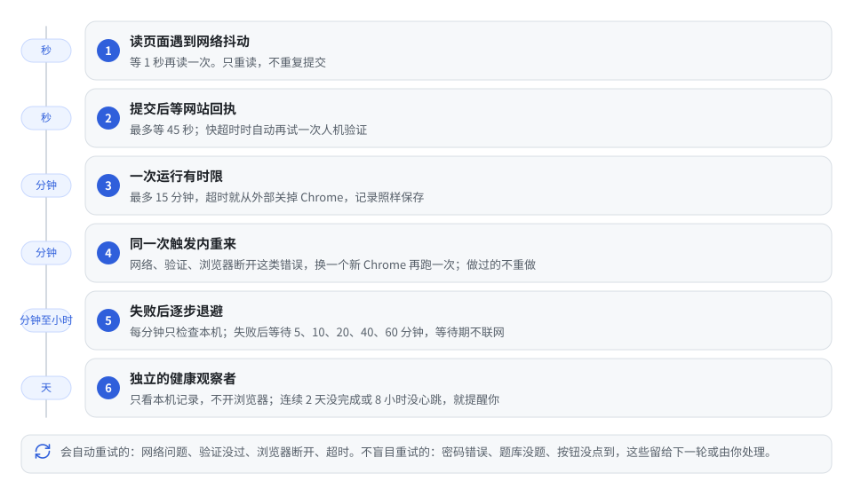

| 层 | 尺度 | 做什么 |
|:--:|:--:|:--|
| 1 | 秒 | 读页面遇到网络抖动，等 1 秒再读一次。只重读不重复提交，因为读取没有副作用 |
| 2 | 秒 | 提交后最多等 45 秒网站的真实回应；快超时时自动再试一次人机验证。没等到的记为「回执没回来」 |
| 3 | 分钟 | 一次运行最多 15 分钟。超时就从外部强制关掉 Chrome，记录照样保存 |
| 4 | 分钟 | 网络、验证、浏览器断开、超时这类错误，立刻换一个新 Chrome 再跑一次。重跑前先看记录，已经确认的动作不再做 |
| 5 | 分钟至小时 | 每分钟检查本机状态；失败后按 5、10、20、40、60 分钟退避，等待期不访问网站；当天已确认的动作不重做 |
| 6 | 天 | 另配一个独立的「健康观察者」：只看本机记录，不开浏览器。连续 2 天没完成，或定时任务 8 小时没心跳，就提醒你 |

**看一个具体的坏日子是怎么被接力救回来的：**

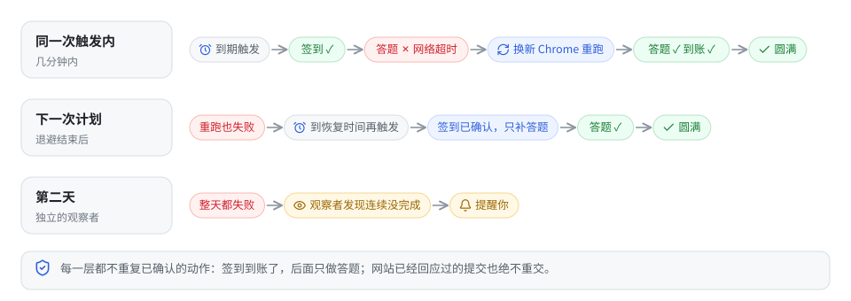

**哪些错误会自动重试（第 4 层）：** 网络超时、网络不可用、页面或验证超时、人机验证没过、浏览器连接断开、运行超时。

**哪些不盲目重试：** 密码错误、题库没题、按钮没点到。这些要么需要你处理，要么留给下一轮自然再来。

### 提交发出去了，回执却没回来

这是最微妙的情况：按钮点了，请求发出去了，但 45 秒内网站没回应。工具不知道网站到底收没收到。重复提交可能被网站当成异常操作，不提交又会断签。所以先在本机数据库保存提交意图，再点击。没有明确证明未点击的请求，后续只核验完成状态和奖励，不自动重交。答题结果不明时，定时任务补查一次；仍未完成且签到已核验时，就返回 `manual_recovery_required` 和 `attention`（失败记录编号、账号、站点日及处理提示），后续触发只更新心跳，不反复打开浏览器。需要先用 `status` 核验，再在网页完成或按 [人工恢复步骤](outputs/一亩三分地本地工具/README.md#quiz-recovery) 明确授权重试一次：

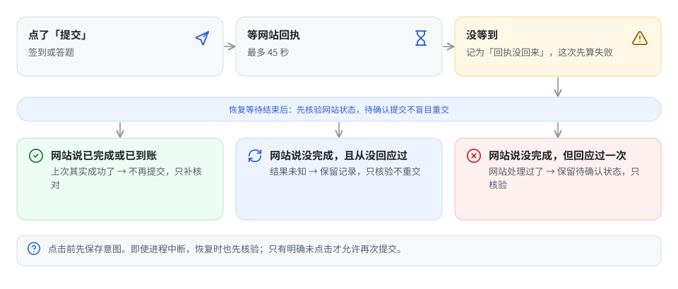

### 为什么要有第二双眼睛

一个程序发现不了自己没被叫醒：定时任务坏了，主计划根本不会跑，也就不会报错。所以要有第二双眼睛在链路的另一端看着。健康观察者不碰账号、不开浏览器，只看本机记录里「最近一次心跳是什么时候」「哪些天没完成」，给出正常、留意或提醒。提醒时你可以接桌面通知。

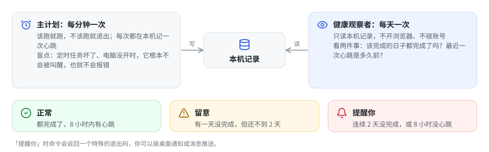

<a id="调度"></a>

## 每天什么时候跑

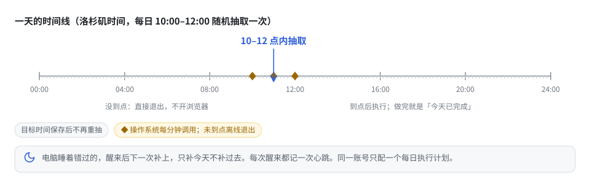

- **计划时间** 默认在洛杉矶 10:00–12:00 抽取到分钟的时间，11 点附近概率较高（Beta(3,3)）。每账号每天只抽一次并保存，重启不会重抽；系统随机源失败会停止，不退回固定种子。夏令时自动处理。已有显式 `schedule_time` 继续按固定模式运行，设置 `schedule_mode: "random"` 可迁移。
- **叫醒方式** 推荐操作系统每分钟直接调用一次。它自己判断该不该跑，没到点、已完成时直接退出、不开浏览器。
- **触发延迟** 由本机调度器、电脑睡眠和网络决定。随机时间是目标，不是执行保证；错过窗口后在同一站点日恢复。固定模式仍报告每 4 小时的恢复时刻。
- **失败恢复** 按已存记录等待 5、10、20、40、60 分钟，上限 60 分钟；`recovery_wait` 期间不访问网站，状态为 `needs_attention`。答题提交结果不明时补查一次，仍无结果则转为 `manual_recovery_required`，需人工处理；这两种状态都不表示当天成功。
- **电脑睡着** 错过的，醒来后下一次叫醒会补上。只补「今天」，不补过去几天的签到。
- **心跳。** 每次叫醒都在本机记一笔，即使什么都没做。健康观察者靠它判断定时任务还活着没有。
- **动作间隔。** 签到确认后抽取一次 30–70 秒间隔并保存截止时间；答题前只等剩余部分，重启和补答不会重新等待一整段。网络延迟可能使实际间隔更长。
- **同一账号只保留一个每日执行计划。** 独立的离线健康观察可以保留；浏览器锁阻止同时操作。

### 网站的「一天」按洛杉矶时间算

这是很多签到脚本出错的地方：用电脑本地日期判断「今天签了没」，跨时区就乱。这个工具一律按网站所在的洛杉矶时间算「今天」，奖励记录的时间也折算成洛杉矶日期再比较。

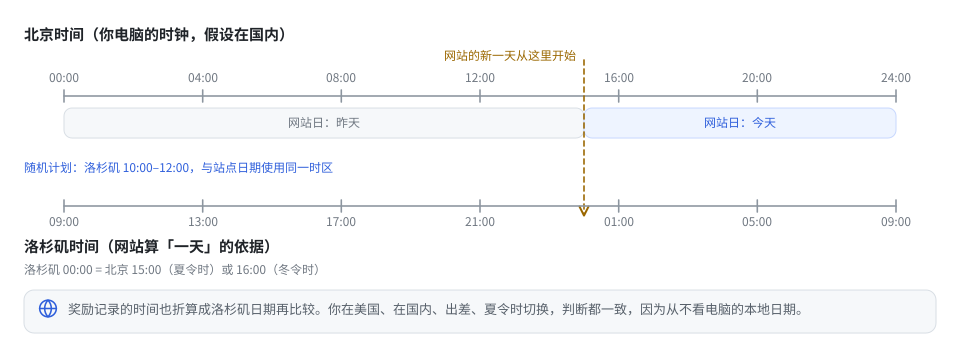

macOS 和 Windows 上定时任务怎么配、健康观察者怎么配，见 [使用说明 › 每日自动运行](outputs/一亩三分地本地工具/README.md#automation)。

<a id="安全"></a>

## 安全与隐私：你的数据在哪


**密码。** 在终端里隐藏输入一次，macOS 放进登录钥匙串，Windows 用系统加密。两者都和这台电脑、这个用户绑定，换电脑要重新配，拷文件过去没用。密码不进仓库、不进日志、不进 AI 助手的对话。


**登录状态。** 只存在专用 Chrome 的设置目录里。退出登录的命令只删这个目录里论坛的登录信息，不碰别的。

**仓库里有什么。** 仓库默认忽略一切文件，只有登记过的源码、题库、文档能入库；你电脑上的账号、记录、数据库所在的目录永远不入库。检查命令还会扫描密钥特征和个人路径，发现就失败。

**网络上只跟论坛自己的网址说话。** 不经过任何第三方服务器，不用打码平台，不上传截图。别的网址在代码里直接拒绝。

**它不会替你做的事。** 顶/踩、评分这类不可撤销或要花大米的操作，工具不做。发帖、回复、收藏、点赞这些互动命令默认只预览，明确要求才会真正写网站，写完还会读回来核对。

<a id="快速开始"></a>

## 快速开始

### 推荐：用已发布的软件包接入 AI 助手

[1point3acres-toolkit 已发布到 PyPI](https://pypi.org/project/1point3acres-toolkit/)。装好 Chrome、Python 3.12 和 [uv](https://docs.astral.sh/uv/getting-started/installation/)，就能启动本地 MCP，无需 Git：

```sh
uvx 1point3acres-toolkit@latest
```

这是 MCP 服务的启动命令。要让 AI 助手调用它，在客户端添加以下配置；具体注册命令见 [MCP 接入](outputs/一亩三分地本地工具/README.md#mcp)：

```json
{
  "mcpServers": {
    "1point3acres-local": {
      "command": "uvx",
      "args": ["1point3acres-toolkit@latest"],
      "env": {"PYTHONUTF8": "1"}
    }
  }
}
```

将这一项合并到客户端已有配置，不要覆盖其他 MCP。使用 TOML 或图形设置的客户端，填入相同的启动命令、参数和环境变量即可。客户端找不到 `uvx` 时，填它的绝对路径。

接入后还需[配置自己的论坛账号](outputs/一亩三分地本地工具/README.md#account)并建立登录；启动 MCP 本身不会配置账号或创建每日计划。账号、专用 Chrome 和历史保存在个人应用数据目录，可通过 `ONEPOINT3ACRES_HOME` 指定位置。`@latest` 在每次重新启动时请求最新兼容发布版本，已运行的服务需要重连，不会自动热更新。

只想先检查程序能否运行，可以执行以下命令：uvx 会检查并准备软件包，随后 `info` 只读取本机状态，不会登录或签到：

```sh
uvx --from 1point3acres-toolkit@latest 1point3acres-toolkit-cli info
```

命令行、账号目录和定时任务的具体步骤见 [软件包安装](outputs/一亩三分地本地工具/README.md#pip)。

### 交给 AI 助手安装：默认自动更新

把项目链接或仓库交给一个能在本机执行命令的 AI 编程助手（Claude Code、Codex 等），可以直接说：

> 帮我安装这个工具，配置每天自动签到答题，并启用默认的自动更新。

**给安装助手：普通用户默认使用 `uvx …@latest`，MCP 和每日计划都要配置；不要因为拿到了仓库就默认安装源码版。** 按 [AI 安装步骤](outputs/一亩三分地本地工具/README.md#ai) 完成账号配置、首次验证与系统定时任务。只有用户明确要求开发、源码运行或固定版本时，才改用相应安装方式。你需要提供论坛用户名和 uid，并按提示在本机安全输入密码。

配置后，每日计划每次启动都会检查并使用最新兼容的 PyPI 发布版本，不用用户手动升级；MCP 在下次启动或重连时更新。正在运行的服务不会中途换版本。维护者需要先把新版发布到 PyPI，单纯更新 GitHub 源码不会更新用户的软件。已有源码或 pip 安装需按 [迁移步骤](outputs/一亩三分地本地工具/README.md#pip) 更换入口并保留数据。

下面的源码安装适合需要改代码的开发者，或继续使用已有仓库版的用户。

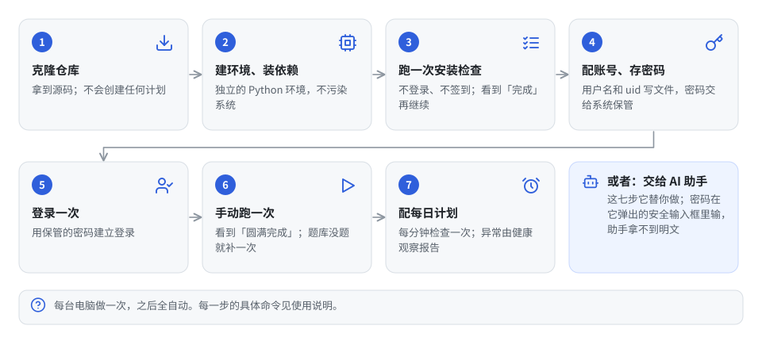

### 开发者源码安装：七步的原理（手动更新）

前置：装好 Git、Chrome、Python 3.12。每一步的确切命令见 [使用说明 › 源码安装](outputs/一亩三分地本地工具/README.md#install)，这里只说每步在做什么、怎么算成功。

1. **克隆仓库。** 拿到源码。克隆本身不会创建任何定时任务，也不会碰网站。
2. **建环境、装依赖。** 建一个独立的 Python 环境，装 8 个锁定版本的库。不污染系统。
3. **跑一次安装检查。** 核对依赖、生成本机配置、跑离线测试，并启动一次临时 Chrome 验证能开。不登录、不签到。看到「完成」才继续。
4. **配账号、存密码。** 写一个只含用户名和 uid 的账号配置；然后在终端隐藏输入一次密码，交给系统保管。
5. **登录一次。** 用保管的密码建立登录。不想存密码也可以微信扫码，但之后的日常自动恢复仍需要密码。
6. **手动跑一次签到答题。** 看到「圆满完成」。出现「题库没题」就按 [自动答题](#答题) 那节补一次答案。
7. **配定时任务。** 先用 `info` 核对当前版本和调度配置，再让系统每分钟执行 `daily --resume`。macOS 使用 launchd；Windows 仓库版提供 `计划.ps1`，可先用 `-Action Install -WhatIf` 预览，再安装。uvx 版计划调用 `uvx --from 1point3acres-toolkit@latest 1point3acres-toolkit-cli daily --resume`（每次启动检查更新，有网络开销）；pip 版调用 `1point3acres-toolkit-cli daily --resume`。调度器应使用入口的绝对路径，并与 MCP 共用数据目录。同一账号只保留一个每日执行计划，再配离线健康观察，及时发现连续失败。

<a id="其他功能"></a>

## 其他功能

这些都是可选的，不装不配也不影响签到答题。所有命令都在工具目录执行，按用途分成六组：


**面经资料。** 采集指定公司的面经帖子，存进本机数据库，导出成 JSON、CSV、Markdown 和一个离线阅读器；可以按关键词、岗位、级别、发帖日期搜索；帖子里的图片能归档到本机并在本机识别文字，不上传。采集可以做成任务，支持暂停和从断点恢复。

**只读浏览。** 站内搜索、读帖、翻版面、看主页、读通知，都不入库、不标记已读。

**互动。** 发帖、回复、收藏、点赞。每个操作都是「先读现状，已经是目标状态就不提交；提交后再读回来核对」。默认只预览，明确要求才真正写网站。

**接给 AI 助手。** 工具同时是一个 MCP 服务（AI 助手调用本地工具的通用接口），用的是和命令行完全相同的函数：

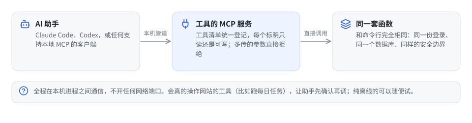

每个命令的参数、返回字段、边界情况，见 [使用说明 › 命令参考](outputs/一亩三分地本地工具/README.md#commands) 和 [MCP 接入](outputs/一亩三分地本地工具/README.md#mcp)。

<a id="常见问题"></a>

## 常见问题

结果里的错误代号先分清是哪一类，大多数不需要你做任何事：


| 看到 | 意思 / 怎么办 |
|:--|:--|
| `not_due`、`already_complete`、`already_done` | 不是故障。还没到计划时间，或今天已经确认完成 |
| `recovery_wait` | 上次失败后的恢复等待期，`retry_at` 给出下次尝试时间；此时不开浏览器，也不代表当天任务成功 |
| `runtime_restart_required` | 源码或配置已变化，当前进程仍使用旧版本；重连 MCP 服务后调用 `runtime_info` 核对 |
| `answer_needed` | 题库没这道题，按 [自动答题](#答题) 补一次答案 |
| `account_not_configured` / `invalid_local_account_config` | 账号配置文件缺失或格式不对：只含用户名和 uid（可选计划时间和心情开关），uid 是正整数 |
| `login_required_credentials_not_configured` | 还没存密码，重做快速开始第 4 步 |
| `login_rejected` / `automatic_login_failed` | 核对账号密码和网站账号状态，不要连续重试同一密码 |
| `unexpected_account` | 浏览器里登录的不是配置里写的账号，工具拒绝操作 |
| `button_not_ready` / `page_challenge_not_resolved` | 页面没就绪或人机验证没过，本次保留失败，看下一轮是否恢复 |
| `browser_connection_lost` / `daily_run_timeout` | 浏览器中途断开或超过 15 分钟；确认尚未提交时自动重开一次，提交结果不明时保留保护并提示处理 |
| `quiz_submission_unconfirmed` / `manual_recovery_required` | 先用 `status` 核验；仍未完成时按 [人工恢复步骤](outputs/一亩三分地本地工具/README.md#quiz-recovery) 处理，不要清空历史强制重跑 |
| `another_task_is_using_the_browser` | 有别的任务在用浏览器，等它结束；确认没配两个定时任务 |
| `consistency_check_failed` | 跑检查命令，按提示修 |
| 定时任务没跑 | 确认任务已启用、路径正确、电脑当时可用；Windows 还需当前用户保持登录。用 `info` 查调度配置、`daily-history` 查当天结果，系统任务退出码为 0 不代表奖励已到账 |

更多错误代号和处理见 [使用说明 › 常见问题](outputs/一亩三分地本地工具/README.md#troubleshooting)。提 Issue 时给出系统、Python、Chrome 版本、用到的命令和脱敏后的结果代号，不要贴账号配置或完整的结果文件。

<a id="维护"></a>

## 更新与维护

**普通用户推荐 uvx 接入。** `uvx 1point3acres-toolkit@latest` 在重新启动 MCP 时请求最新兼容发布版本，无需 `git pull`；已有进程需要重连。我们必须把新版本发布到 PyPI，只更新 GitHub 不会更新软件包用户。不带 `@latest` 的 uvx 会复用缓存，详见 [uv 官方说明](https://docs.astral.sh/uv/concepts/tools/#tool-versions)。已有用户需要修改客户端保存的启动配置，仓库用户另需迁移个人数据，具体见使用说明。

仓库版供开发者使用，更新的原理是「先停、再拉、再检查、再开」：

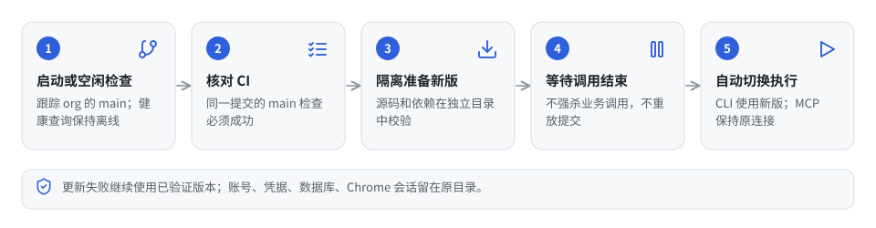

你电脑上的账号、密码、数据库、Chrome 设置都不受更新影响。计划时间之类的个人配置写在账号配置里，不改仓库里的代码，更新时才不会冲突。具体命令见 [使用说明 › 更新与维护](outputs/一亩三分地本地工具/README.md#maintenance)。

**确认更新已生效。** 仓库版在工具目录执行 `./运行.sh info`（Windows：`运行.cmd info`）；uvx 版执行 `uvx --from 1point3acres-toolkit@latest 1point3acres-toolkit-cli info`；pip 版执行 `1point3acres-toolkit-cli info`。它只读本机版本与有效配置，不读凭据、不开浏览器。接入 AI 助手的常驻 MCP 服务需要在更新源码或账号配置后重连，再调用 `runtime_info`，确认 `restart_required=false`，且 `loaded.fingerprint` 与 `disk.fingerprint` 一致。

**pip 安装版升级。** 暂停每日计划并等待当前运行结束后，在原安装环境执行 `python -m pip install --upgrade 1point3acres-toolkit`；用 `info` 核对后恢复计划，并重连使用该环境的 MCP 服务。账号和历史仍保留在个人应用数据目录中。`计划.ps1` 是仓库版入口，不随 wheel 分发。

**几点须知：**

- 每位使用者配置自己的论坛账号，不会继承别人的登录、资料或定时任务；克隆本身不会创建任务，也不会执行任何网站操作。
- 读取内容以当前账号的权限为准。帖子详情或站内搜索返回结果，不等于已存进资料库。
- 已有实测不构成永久通过人机验证的保证；网站或验证变化可能导致某天失败，程序会如实记录。
- 本工具只用你自己的账号、在你自己的电脑上、按网页正常流程操作，请遵守论坛规则，自行承担使用风险。

<a id="开发者"></a>

## 给开发者

下面三节是给想读代码、改代码的人看的，普通使用者可以跳过。

<a id="技术栈"></a>

### 技术栈

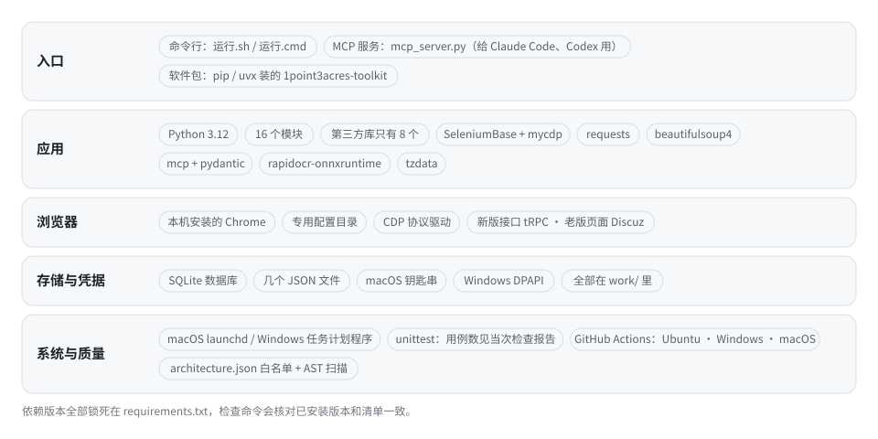

| 方面 | 用了什么 | 为什么 |
|:--|:--|:--|
| 语言 / 运行时 | Python 3.12，虚拟环境在 `work/cf-probe-venv` | 标准库够用（`sqlite3`、`unittest`、`zoneinfo`、`ctypes`），第三方依赖只有 8 个 |
| 浏览器自动化 | 本机安装的 Chrome + SeleniumBase 4.53.8（CDP 模式）+ mycdp 1.4.0 | 用 Chrome DevTools Protocol 直接驱动真实 Chrome，走你自己的登录会话，Cloudflare 验证由 SeleniumBase 的 CDP 方案处理 |
| 站点访问 | 页面内调用站点自己的 tRPC 接口（身份、题目、积分流水）；监听网络事件确认签到、答题的响应 | 读接口比解析页面稳；提交只认站点真实响应 |
| HTML 解析 | beautifulsoup4 4.15.0 | 面经、版面、搜索结果这些老版 Discuz 页面只有 HTML |
| 数据存储 | SQLite（一个文件）+ 几个 JSON 文件；仓库版在 `work/`，安装版在个人应用数据目录 | 单文件、零配置、可离线查 |
| 凭据保护 | macOS 登录钥匙串 / Windows DPAPI | 系统级加密，和机器、用户绑定，代码里不出现明文 |
| 调度 | macOS launchd / Windows 任务计划程序 | 用系统自带的，不装守护进程 |
| MCP 服务 | mcp 2.2.0 + pydantic 2.13.5，stdio 传输 | 让 Claude Code、Codex 等 AI 客户端调用已登记的工具（清单见 `architecture.json`） |
| 分发 | PyPI 软件包 `1point3acres-toolkit`，用 hatchling 打包；`server.json` 用于 MCP 官方目录登记 | 一条命令安装，支持 AI 客户端调用 |
| 本机 OCR | rapidocr-onnxruntime 1.4.4 | 面经里的截图在本机识别文字，不上传 |
| 时区 | tzdata 2026.3 | Windows 没有系统时区数据库，`zoneinfo` 需要它 |
| 测试 | Python 标准库 `unittest`，实际用例数见检查报告 | 不引入测试框架；跳过也算失败 |
| CI | GitHub Actions：Ubuntu 静态检查（构建软件包并核对内容）→ Windows 2022 / 2025 + macOS 15 单元测试 → Windows 2025 + macOS 15 集成测试 → 汇总 | 和本地检查命令跑的是同一个 `check.py` |
| 治理 | `architecture.json` 白名单 + `governance.py` 用 AST 扫源码 | 模块依赖、外部库归属、状态字面量、生成文件是否过期，都是机器验，不靠人记 |
| 配图 | `docs/diagrams.py`，纯标准库生成 SVG | 一套样式画 29 张图，改一处全局生效；深色模式自动适配 |

**维护者发布。** 通过 PR 将版本变更合并到 main，确认目标提交的 CI 通过，创建对应 GitHub Release，再手动触发 [Publish to PyPI](https://github.com/vivian-labs/1point3acres-toolkit/actions/workflows/publish.yml)。Trusted Publishing 授权已配置，无需保存长期 token；每次仍需触发发布，合并 main 不会自动上传。完整步骤见 [发布流程](outputs/一亩三分地本地工具/README.md#publishing)。

依赖清单在 [`requirements.txt`](outputs/一亩三分地本地工具/requirements.txt)，版本全部锁死，检查命令会核对已安装版本和清单一致。

<a id="代码结构"></a>

### 代码结构

代码都在 `outputs/一亩三分地本地工具/` 一个目录里，16 个 Python 模块，分五层，依赖只能往下指。哪个模块能引用哪个，都写在 `architecture.json` 里，检查命令用 AST 扫一遍源码验证，越界就失败。

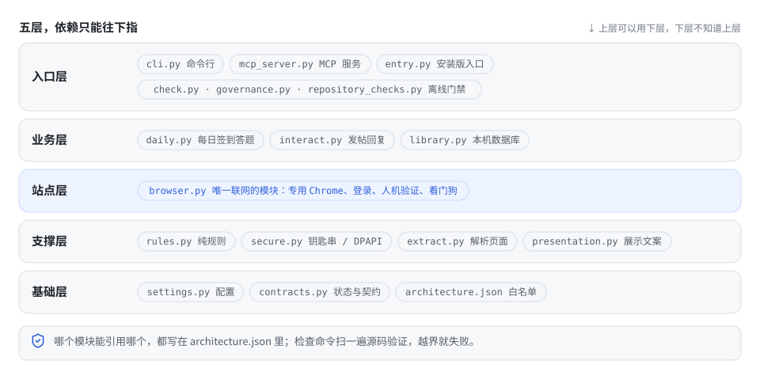

| 模块 | 职责 |
|:--|:--|
| `cli.py` | 命令行入口：解析子命令，打印 JSON，决定退出码 |
| `mcp_server.py` | MCP 服务：把同样的函数暴露为 MCP 工具，多余参数直接拒绝 |
| `entry.py` | 安装版命令入口：恢复脚本布局，再交给 `mcp_server` 或 `cli` |
| `check.py` | 唯一的离线检查入口：阶段选择、依赖校验、跑测试、生成报告 |
| `governance.py` | 离线版本诊断与 AST 扫描：依赖白名单、外部库归属、不许写状态字面量、生成文件是否过期、文档链接是否断、打包文件是否一致 |
| `repository_checks.py` | 看 `git ls-files`：没登记的文件、缺失的文件、可执行位、二进制、密钥特征、个人路径、测试分组 |
| `daily.py` | 每日签到 + 答题 + 核对奖励 + 学习 + 重试，本文讲的原理都在这 |
| `interact.py` | 发帖、回复、收藏、点赞、通知：先读现状、只在不同时提交、提交后再读回核对 |
| `library.py` | SQLite 资料库：每日历史、心跳、面经采集、站内搜索、导出、任务、媒体归档、OCR、学到的答案 |
| `browser.py` | 唯一联网的模块：启动专用 Chrome、CDP 通信、登录、Cloudflare 验证、微信扫码、窗口隐藏、看门狗、读积分流水 |
| `rules.py` | 纯规则：题库匹配、站点日、奖励核对、心情抽取、健康判定、面经大纲提取 |
| `corpus.py` | 离线语料提取与校验、风格抽取、文字和近似句去重；不联网、不提交网站 |
| `secure.py` | 钥匙串 / DPAPI 读写 |
| `extract.py` | BeautifulSoup 解析论坛各种页面 |
| `presentation.py` | 阅读器文案目录和业务状态到展示状态的映射 |
| `settings.py` | 所有配置、默认值、路径、限额；不含任何密码；两种安装方式的目录约定 |
| `contracts.py` | 状态枚举、动作定义（签到 / 答题各自的页面路径、接口名、奖励标题）、结果契约 |

仓库的整体布局：

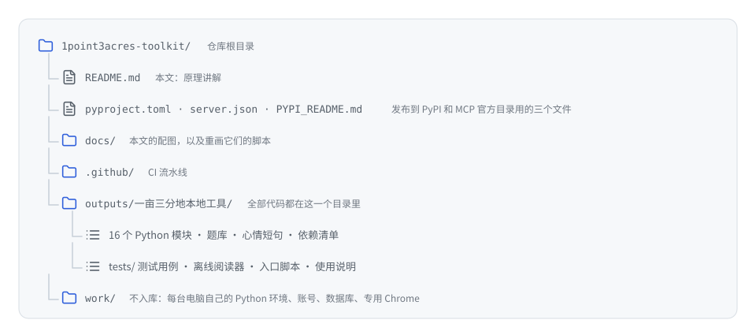

<a id="测试"></a>

### 测试与 CI

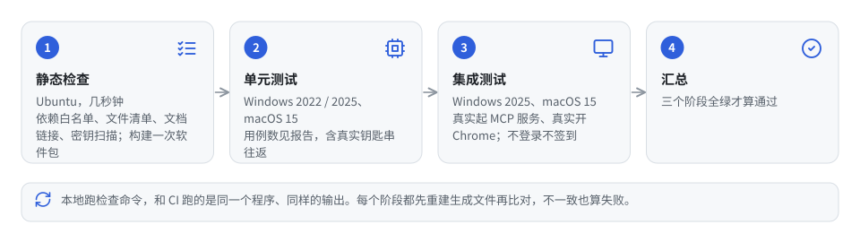

本地和 CI 跑的是同一个检查命令，输出一段 JSON，`status=complete` 才算过；有问题时 `violations` 列出每一条。它分三个阶段，可以只跑其中一个：

- **静态检查：** 每个模块只引用白名单里的模块；外部库只在登记的模块里引用；状态字段不许写字符串字面量，必须用契约模块里的枚举；数量上限这类默认值必须来自配置模块；依赖清单和登记一致；MCP 工具名和登记一致；CSS 只能用视觉取值文件里的值；文档里的相对链接都存在；`git ls-files` 里没有未登记的文件，也没有登记了但不存在的文件；shell 入口带可执行位；没有二进制、密钥、个人路径；打包文件里的版本、依赖、入口命令和登记一致。几秒钟跑完。
- **单元测试：** 每日流程的每个分支（已完成、没到点、题库没题、答错、提交丢失、重试一次、看门狗超时、站点日翻页……）、题库匹配、奖励核对、心情抽取、健康判定、凭据读写（macOS 上真实往返钥匙串）、命令行参数、MCP 参数守卫、面经解析、互动命令的先读后写。
- **集成测试：** 用 stdio 真实拉起 MCP 服务并握手；真实启动一次 Chrome 打开离线阅读器。不登录、不签到、不访问站点。

CI 在 Ubuntu、Windows 2022、Windows 2025、macOS 15 上分阶段跑，每个阶段都先重建生成文件再比对，生成物和源码不一致也算失败。Action 一律按 commit 哈希锁定，不用 secrets，不用自托管 runner。

**改代码：** 改完统一跑检查命令，先不带参数做完整离线检查与回归，再带 `--sync` 重建生成文件后再检查。新增模块、新增依赖、新增 MCP 工具、新增文件，都要同步登记到 `architecture.json`，否则检查会失败，这是故意的。改了配图就重新跑一遍 `python3 docs/diagrams.py`，SVG 是生成物，不要手改。

语料增加一个登记的离线模块 `corpus.py` 和两份分发数据。`journal-corpus.json` 单独获准最多 4 MB 的 UTF-8 文本，其他文件仍维持原大小限制，敏感信息扫描继续执行。语料文件参与运行版本指纹；更新后常驻 MCP 需要重连，原始下载文件和个人使用历史不进入仓库。
